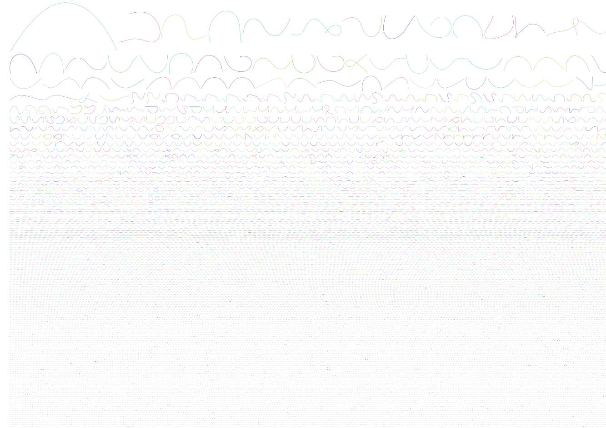

# 1. Bandage - image of the contigs

The Pictures shows our contig. Colour is chosen according to the binning, the length is the length of the sequence, and loops represent k-merks with multiple continuing options. Alot of the smaller fragments cant be assigned to contigs
# 2. 
 ## What is N50?
 N50 is the contig length, where at least 50% of the contigs are equal or longer.
 In our cae 2963 
 ## How many contigs in the assembly?
57 414
## What is the total length of the contigs?
145675865 Bp