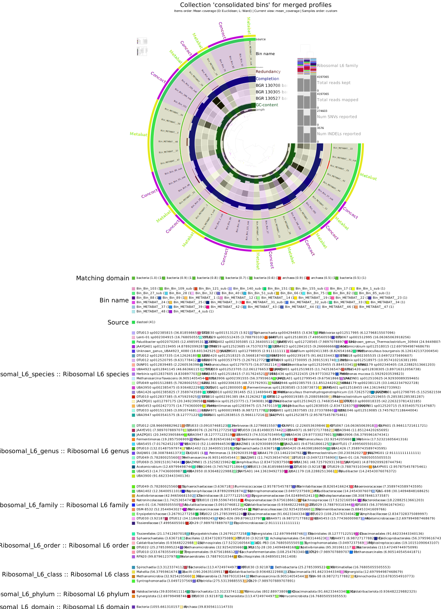
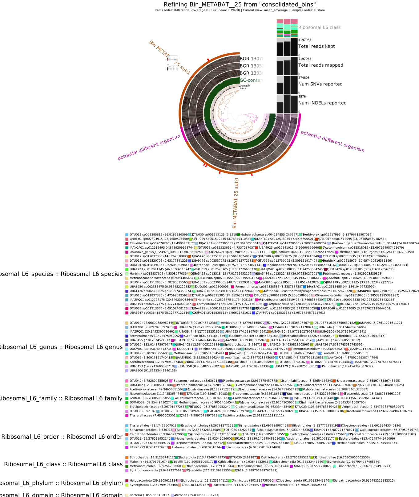

# Questions day 5

*`continuing with questions from day 3`*

# Day_3 Nr.4
Metabat:

* `which binning strategy gives the best quality archea bins?`  
  dastool (consolidated) gives the best quality, which was expected since it it not a binner and just merges the results of the two binners. MEtabat2 seems better for our data than concoct. 
  
* `how many archaea bins do you get of high quality?`   2
---------------------------------------------------
-----------------------------------------
# Day4 Nr.1
* `Do you get Archea bins that are chimeric?`  
 hint: look at the CSS score (explained in the lecture) and the column PASS GUNC in the tables outputs per bin in your gunc_output folder.*   
clade seperation index close to one = chimeric  
  -metabat archea = not chmieric | species level =0.9  
  -Concoct archea = chimeric | kingdom, phylum, class = chimeric  
   After wards it isnt marked as chimeric, because the groups have not been named yet

* `In your own words (2 sentences max), explain what is a chimeric bin.`  
  A chimeric bin contains a MAG that is created from more than one genome. So a MAG mixture of at least two different species

  # Day4 Nr.2
  * `Does the quality of the archea improve? (Metabat2-archea MAG)`
    * Before: Comp.:97.4   Red.:5.3
    * After:  Comp.:93.4   Red.:5.3
    * after removing some bins clustered by differential the composition is reduced but the redundancy stay the same. So visually it improves the quality, but the given score doesnt represent it

# Day4 Nr.3
* `how abundant are the archea bins in the 3 samples`  
  * Metabat: 1.76 | 1.14 | 0.58
  * Concoct: 0.96 | 0.00 | 0.40
----------------------
# Day 5 Nr1
* `Species assignment to the archea?`  
Bin_METABAT__25_sub1	total_length:1661314	num_contigs:205	N50:9690	GC_content:59.5514543073426	percent_completion: 93.4210526315789	percent_redundancy:5.26315789473684	Archaea	Halobacteriota	Methanomicrobia	Methanomicrobiales	Methanoculleaceae	Methanoculleus	*`Methanoculleus sp012797575`*

* `Does the high quality bin assignment need revision?`
  * For the metabat Archea MAG: probably not close to 95% completion and close to 5% redundancy. But more revision is always better if you got the time and money for it
  * The concoct Archea MAG needs more refinement

  
