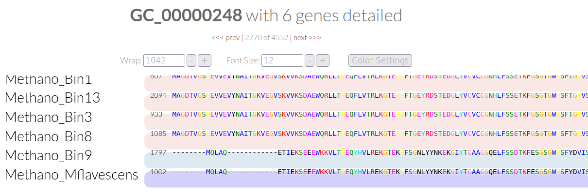

# Day6 Nr.1

* `How do the MAGs compare in size and number of contigs to the full genome?` \
  -The bins are all smaller than the full Methano_mflavenscens genome. The differ from 1.3 mbp to 2.6 mb \
  -The contig number is much higher, since the full genome only cosists of 1 contig. Most of the contigs are > 2.5 kb \
  -The longest contigs vary between 14 kb and 65 kb (compared to 3.2 mb of the full genome)
  -HMM (single copy core genes) differ from 43 to 80. the complete genome contains 72
  

* `Based on the contigs number, size and number of marker genes (HMM hits), which two MAGs are the best and which is the worst?` \
 -The worst MAGS are: 
    *10 
    *   contain a lot of Contigs >2.5 kb
    * the least HMM archea hits 
      * shortest total length
    * 5 
      * no approx. genome found 
      * to few HMM hits 
      * alot of contigs below 2.5 kb
 -The best are:
    * 13 
      * most contigs above 20kb
      * most archea HMM hist 
    * 9 
      * most contigs above 10 kb
      * longesr total length
      * with no approx. bacteria genome

## Nr.3.1 Pangenome
cat external_genomes.txt
name	contigs_db_path
Methano_Bin1	/work_beegfs/sunam236/Day6/02_contigs-dbs/Bin1.db
Methano_Bin10	/work_beegfs/sunam236/Day6/02_contigs-dbs/Bin10.db
Methano_Bin13	/work_beegfs/sunam236/Day6/02_contigs-dbs/Bin13.db
Methano_Bin3	/work_beegfs/sunam236/Day6/02_contigs-dbs/Bin3.db
Methano_Bin5	/work_beegfs/sunam236/Day6/02_contigs-dbs/Bin5.db
Methano_Bin8	/work_beegfs/sunam236/Day6/02_contigs-dbs/Bin8.db
Methano_Bin9	/work_beegfs/sunam236/Day6/02_contigs-dbs/Bin9.db
Methano_Mflavescens	/work_beegfs/sunam236/Day6/02_contigs-dbs/Mflavescens.db

## Nr. 3.2
The command provides its output as a table to the standard output of the terminal. What can you add to the code to direct output to, e.g. a .txt file?  
* 

## Nr. 5 
*`Scroll to the top of the help and find out which INPUT FILES you need. Write the command and use the additional flag -P. What is the -P flag for?`  
The -P flag declares the port number used (default 8080)

## Nr. 6

* `Based on the frequency clustering of genes, do you think all genomes are related? Why?`
  * loosely related yes, all SCGs are clustered in the same regon and they all should be Archea. 
  * But Bin9 seems to be closer related to Mflavescens than the other three bins. The other three are closer to each other.

* `How does the reference genome compare to its closest bin? Tip: Consider the genome depiction and layers above`
  * pretty similar. Bin9 has most of the gene clusters of the reference genome
  * When looking at some example genecluster alignments, Bin9 and the reference are much more similar, than the other three. Even in the SCG region
  
* `What ranges are used determine a prokaryotic species? How high can you go until you see changes in ANI? What does the ANI clustering tell you about genome relatedness?`
  * prokaryotic species cut off 95%
    * So Bin9 and refence seem to be one species. The other four differ from the reference, but share a species with each other
  * Differences within the clustered bins appear at 99%
    * 99.5%: Bin1 not related to the other
    * 99.6% Bin13 related to 3 and 8, Bin8 and 3 loosely related
    * 99.7% only relatedness between Bin9 and reference
  * Higher percentage=higher approximate relatedness. 95% cutoff for the same species in prokaryotes. 

* `How are Methanogenesis genes distributed across the genome?`
  * distributed across the entire genome, not closely clusteres
  * But only one methanogenesis gene in the region only available in the reference genome

Final pangenom view

-------------------------------
*`What observations can you make regarding the geometric homogeneity between all genomes and the functional homogeneity?`
* 20 Genes match. All of them are in the previously marked SCGs region
* The functions should not be impaired, since SCGs are probably highly conserved, due to their very important and essential functionality
* The aminoacid structe differs though, but probably not effecting the polarity, or structure in the protein
  * M.flavescens and Bin 9 differ from the other four. They share the same SNPs, deletions, or insetions compared to the other four bins
  

------------------------------------
-------------------------------------
------------------------------------
# Blastkoala
*`Can the organism do methanogenesis? Does it have genes similar to a bacterial secretion system?`
  * Yes it can do methanogenesis  
    * CO2, Acetate and Methanol
  * Yes it contains genes also used in bacterial secretion systme (7)

