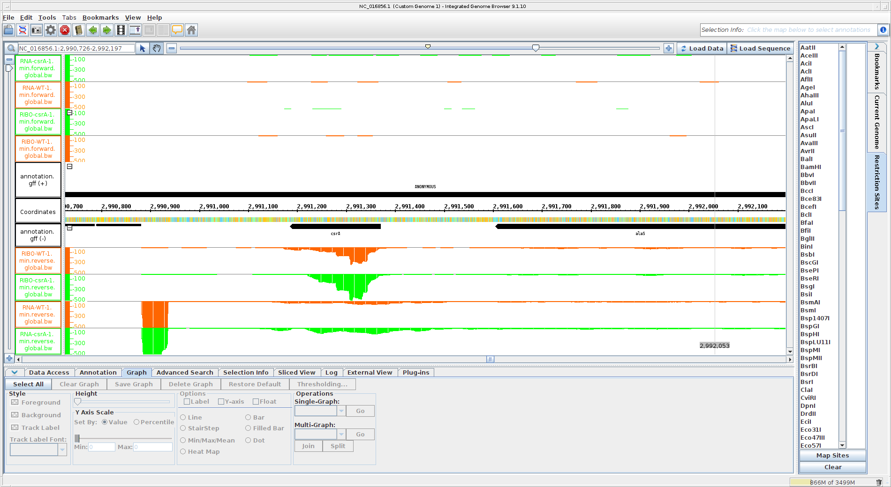
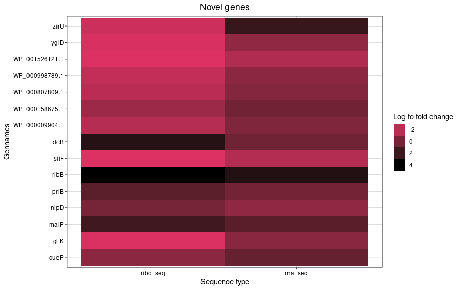

# csrA gene Infos


* Start codon
  * ATG (reverse complemantary TAC)
* Stop codon
  * TAA (reverse complementary ATT)
* Aminoacid length
  * start 2991371-2991185=186 bp
  * 186 bp/3=62 AS
  * 61 Aminoacids (stop is not a AA)
  * mall protein because <70 AS
* its SD (consensus at -7 or -4)
  * Shine dalgano
* The name of the upstream gene
  * upstream alaS
* Is csrA translated?
  * Yes, Ribosome coverage along the entwire genes
  * UTRs clearly visible next to it

# Find a significantly differential expressed gene (wt/scrA Mutant)
* Look at p-value <0.05 in table


# create heatmaps from RNA+Ribo analysis

```
ggplot(df, aes(seq_type,name, fill=log2fold_change))+geom_tile() +
  scale_fill_gradient(low='#de3163', high='black') +
  theme_linedraw() + 
  labs( x = "Sequence type", y = "Gennames") +
  guides(fill=guide_legend(title="Log to fold change")) +
  ggtitle("Novel gene names") +
  theme(plot.title = element_text(hjust = 0.5))
```


```
ggplot(df_identifier, aes(method,Identifier, fill=log2FC))+geom_tile() +
  scale_fill_gradient(low='blue', high='grey',) +
  theme_linedraw() + 
  labs( x = "mRNA", y = "Identifier") +
  guides(fill=guide_legend(title="Log2FC")) +
  ggtitle("Novel genes identifier") +
  theme(plot.title = element_text(hjust = 0.5), axis.text.y=element_blank() )
```