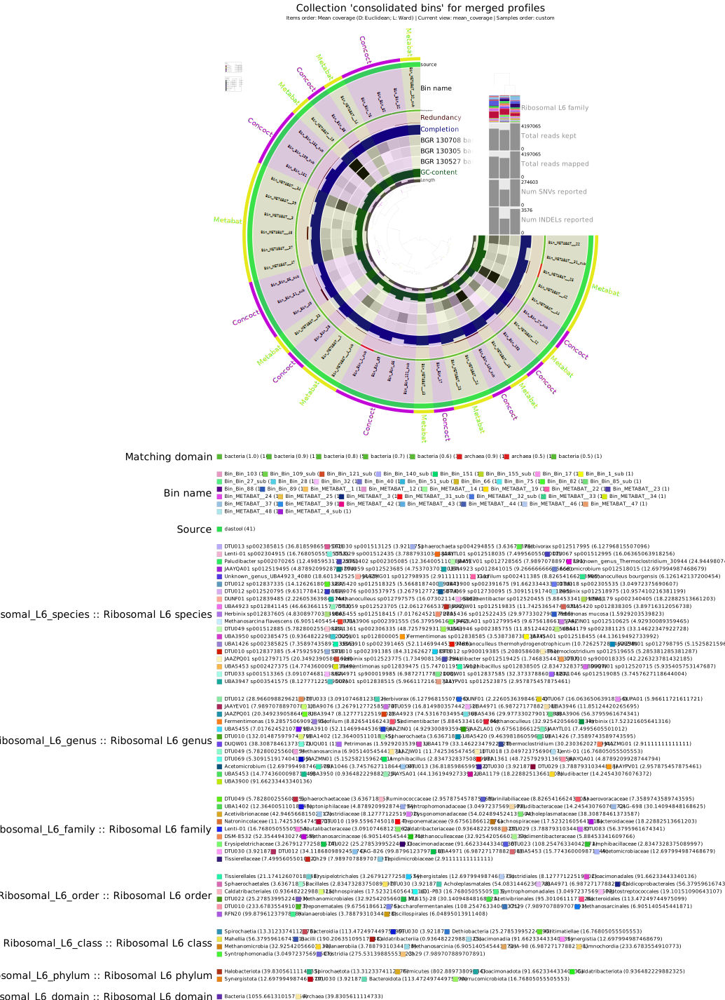
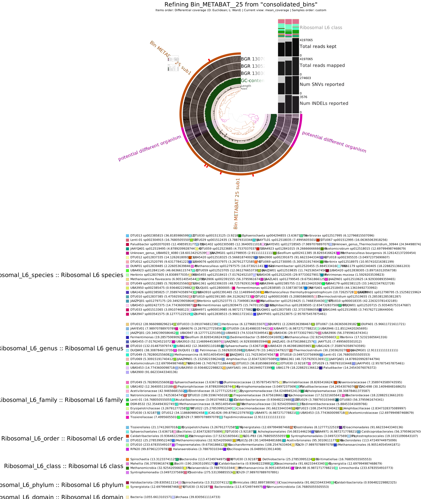
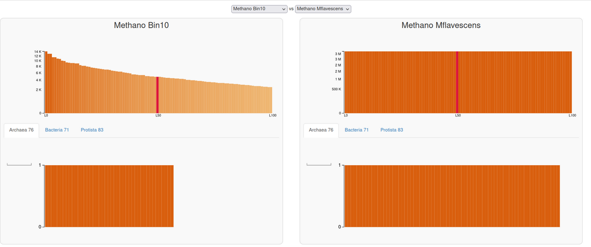
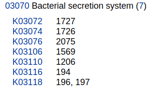
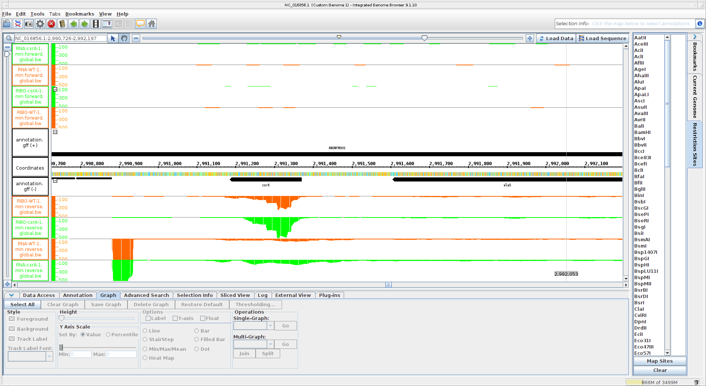
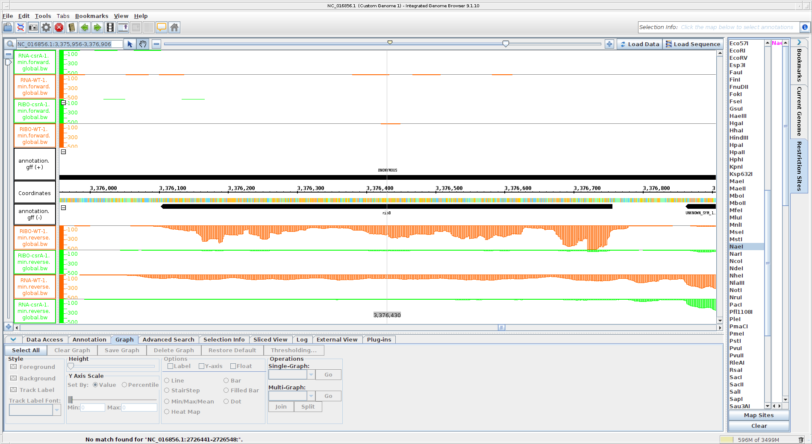
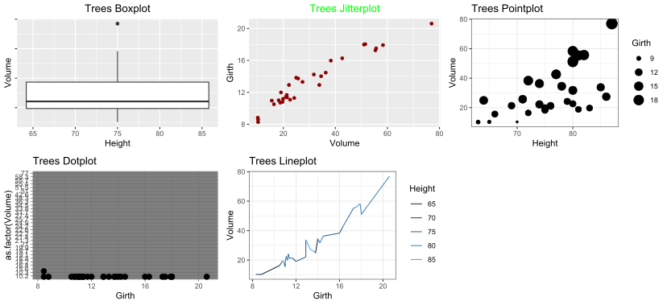

Protocol_bio217_Hendrik Bethge 
# 1. Metagenome assembled Genomes (MAGs)
## 1.1 Background information
The goal of this project was to learn how to handle and interprete metagenomic data from the raw read to the assembled MAGs. 

This process consists of five steps:
 1. Pre-processing of the raw reads 
 2. Assembling the reads into contigs/fasta
 3. Assessing the quality of assemblies
 4. Binning the contigs into MAGs
 5. Assessing completeness, contamination and strain heterogeniety of the MAGs

### Dataset 
The samples were taken from a biogas plant near Cologne over the course of 587 days. <br> Samples were taken once a month and analysed  based on 16S amplicon sequences by Martin Fisher (https://sfamjournals.onlinelibrary.wiley.com/doi/full/10.1111/1751-7915.13313). <br> In addition to the amplicon sequencing, the samples were also sequenced for metagenomics. \
In this protocoll three exemplanary samples from this dataset were analysed.

### HPC system
 All steps were run on the HPC-server of the CAU (CAU-cluster) via **Bash scripts** unless specified otherwise. <br>
 To access the HPC-server:
 ```
 ssh -X sunam???@caucluster.rz.uni-kiel.de
 ```
 The scripts were written in `Sublime Text` and executed though a Linux Shell.
```
sbatch <script.sh>
```
A script should contain the following information:
1. The shebang
2. Processing requirements as #SBATCH commands
    * Reservation
    * Nodes to use
    * CPUs (for multithreading)
    * memory requirements
    * time
    * working directory
    * log files
    * partitions
3. Stdinand Stderr paths
4. Slurm modules needed for the task
5. The command
6. jobinfo

Example bash script:
```
#!/bin/bash
#SBATCH --nodes=1
#SBATCH --cpus-per-task=8
#SBATCH --mem=32G
#SBATCH --time=01:00:00
#SBATCH --job-name=example
#SBATCH --output=example.out
#SBATCH --error=example.err
#SBATCH --partition=all
#SBATCH --reservation=biol217

#activate environment
module load miniconda3/4.7.12.1
conda activate /home/sunam226/.conda/env/anvio
#Commandlines
example.command
#this prints the required resources into your logfile
jobinfo
```
For the course we were able to access the HPC with special persissions through the reservation command.\
Unless specified otherwise all commands were run in a **miniconda environment**.

 ### Tools used:
 | Tool | Version | Repository |
| --- | --- | --- |
| fastqc | 0.11.9 | [FastQC](https://github.com/s-andrews/FastQC ) |
| fastp | 0.22.0 | [fastp](https://github.com/OpenGene/fastp ) |
| megahit | 1.2.9 | [megahit](https://github.com/voutcn/megahit ) |
| samtools | 1.9 | [samtools](https://github.com/samtools/samtools ) |
| QUAST | 5.0.2 | [quast](https://quast.sourceforge.net/quast ) |
| Bowtie2 | 2.4.5 | [bowtie2](https://bowtie-bio.sourceforge.net/bowtie2/index.shtml ) |
| Concoct | 1.1.0 | [CONCOCT](https://github.com/BinPro/CONCOCT ) |
| MetaBAT2 | 2.12.1 | [Metabat2](https://bitbucket.org/berkeleylab/metabat/src/master/ ) |
| DASTool | 1.1.5 | [DAS_Tool](https://github.com/cmks/DAS_Tool ) |
| anvi´o | 7.1 | [anvi’o](https://anvio.org/ ) |
| GUNC | 1.0.5 | [GUNC](https://grp-bork.embl-community.io/gunc/ ) |

-----------------------------
## 1.2 Pre-processing of the raw reads
The raw reads were copied into the working directory
```
mkdir /work_beegfs/sunam236/day2

cp /home/sunam226/Day2/0_raw_reads/*.fastq.gz /work_beegfs/sunam236/day2
cd ./day2
```
The quality of the reads was analysed with `FastQC`, based on the phred quality score. 
```
for i in *.gz; do fastqc $i -o output_folder/; done
```
The sequences were trimmed with `Fastp`
```
for i in `ls *_R1.fastq.gz`;
do
    second=`echo ${i} | sed 's/_R1/_R2/g'`
    fastp -i ${i} -I ${second} -R _report -o ../clean_reads/"${i}" -O ../clean_reads/"${second}" -t 6 -q 20

done
```
--------------------------------------
## 1.3 Assembling the reads into contigs/fasta
The processed reads were assembled into contigs using `Megahit`.
```
cd /work_beegfs/sunam236/day2/clean_reads

megahit -1 BGR_130305_R1.fastq.gz -1 BGR_130527_R1.fastq.gz -1 BGR_130708_R1.fastq.gz -2 BGR_130305_R2.fastq.gz -2 BGR_130527_R1.fastq.gz -2 BGR_130708_R2.fastq.gz --min-contig-len 1000 --presets meta-large -m 0.85 -o ../megahit -t 20   
```
The contigs were transformed into FASTG files to visualized in `Bandage`. 
```
cd /day3/3_coassembly/

megahit_toolkit contig2fastg 99 final.contigs.fa > final.contigs.fastg       
```          
Opened Bandage and loaded the .fastg file

**<u>Question 1**: <br> 
Submit your generated figure and explain shortly what you can see </u>

The picture shows the de novo created contigs from the processed reads
* The length of each line represents the length of the contig sequence
* Loops represent k-mers with multiple continue options
* The colour is selected based on assumed MAG assignment (bins)
* The smaller fragments are reads, that were not able to be assigned to any of the longer contigs 
-------------------------------
## 1.4 Assessing the quality of assemblies
The quality assessment of the megahit results was performed with `Quast`. The output is given as PDF and html.
```
cd /work_beegfs/sunam236/3_coassembly/

metaquast -t 6 -o ../3_metaquast/ -m 1000 final.contigs.fa
```
*This step did not work due to a permission error, so the outpout was copied from a backup*

**<u>Question 2**: <br> 
What is your N50 value?</u>
* 2963 

<u>How many contigs are assembled?</u>
* 57414

<u>Whats is the total length of the contigs?</u>
* 145675865 Bp = 145,7 Mb

----------------------------------
## 1.5 Binning contigs into MAGs
Binning of the contigs: <br>
To make the next steps easier the contig names were shortened. *This step was performed directly in the console, without a bash script*
```
anvi-script-reformat-fasta final.contigs.fa -o /work_beegfs/sunam236/day3/contigs.anvio.fa --min-len 1000 --simplify-names--report-file name_conversion.txt
```
Afterwards the bins were mapped in a loop, so every final.contigs.fasta recieved a corresponding mapping file. 
```
module load bowtie2
cd ./2_fastp/

for i in  `ls *mapped_R1.fastq.gz`;
do
    second=`echo ${i} | sed 's/_R1/_R2/g'`
    bowtie2 --very-fast -x ../4_mapping/contigs.anvio.fa.index -1 ${i} -2 ${second} -S ../4_mapping/"$i".sam 
done
```
The output are sequence mapping files (.sam), which were converted to binary alignment and map files (.bam).
```
module load samtools

cd ./4_mapping/

for i in *.sam; do samtools view -bS $i > "$i".bam; done
```
### 1.5.1 Anvi'o
From here on `anvi'o` commands were used. <br> The **An**anlysis and **Vi**sualization plattform for microbial **'O**mics combines many of the computational strategies of data-enabled microbiology.

A contigs.db file was created, which contains key information associated with the sequences. <br> This command computes k-mer frequencies for each contig, soft-split contigs larger than 20000 bp into smaller ones and identifies open reading frames using Prodigal.

```
cd /work_beegfs/sunam236/day3/

anvi-gen-contigs-database -f ./4_mapping/contigs.anvio.fa -o ./5_anvio_profiles/contigs.db -n 'biol217'
```
Afterwards a Hidden Markov Models (HMM) was run on the contigs, searching for specific single copy core genes (SCGs) with known functions. 
``` 
anvi-run-hmms -c ./5_anvio_profiles/contigs.db 
```

The result was visualized with anvi'o interactive (directly in the console):
```
srun --pty --mem=10G --nodes=1 --tasks-per-node=1 --cpus-per-task=1 --partition=all /bin/bash
```
Note the accessed node!
```
conda activate /home/sunam225/miniconda3/miniconda4.9.2/usr/etc/profile.d/conda.sh/envs/anvio-7.1

anvi-display-contigs-stats contigs.db
```
Open a new terminal, not logged into HPC
```
ssh -L 8060:localhost:8080 sunam236caucluster-old.rz.uni-kiel.de

ssh -L 8080:localhost:8080 node???
```
Open http://127.0.0.1:8060/ in your browser
### 1.5.2 Binning with Anvio
Sorted and indexed the .bam files with `samtools` in anvi'o.
```
cd ./4_mapping/

for i in *.bam; do anvi-init-bam $i -o ../5_anvio_profiles/"$i".sorted.bam; done
```
An anvio profile was created to store sample-specific information about the contigs in a single profile. <br> It processed only contigs >2500 nt.<br>
Processing includes:
* Recovery of mean coverage, SD of coverage and average coverage for the inner quartiles.
* Characterization of single nucleotide variants (SNVs)
```
cd ./5_anvio_profiles

for i in `ls *.sorted.bam | cut -d "." -f 1`; do anvi-profile -i "$i".fastq.gz.sam.bam.sorted.bam -c contigs.db -o ../6_profiling/$i; done
```
This created a folder containing profiles.db and a .txt log.<br>

In the next steps all profiles of the different samples were merched into one:
```
cd ./6_profiling/

anvi-merge ./BGR_130305_mapped_R1/PROFILE.db ./BGR_130527_mapped_R1/PROFILE.db ./BGR_130708_mapped_R1/PROFILE.db -o ./ -c ../5_anvio_profiles/contigs.db --enforce-hierarchical-clustering
```
In this course two different Binners were used: `Metabat2` and `Concoct`. The result of both Binners were consolidated using `DASTool`. *The binning steps did not work, so the files were copied from a back up!*

#### **Binning with Metabat2**
```
cd ./6_profiling/

anvi-merge ./BGR_130305_mapped_R1/PROFILE.db ./BGR_130527_mapped_R1/PROFILE.db ./BGR_130708_mapped_R1/PROFILE.db -o ./ -c ../5_anvio_profiles/contigs.db --enforce-hierarchical-clustering
```
#### **Binning with CONCOCT**
```
anvi-cluster-contigs -p /PATH/TO/merged_profiles/PROFILE.db -c /PATH/TO/contigs.db -C consolidated_bins --driver dastool -T 20 --search-engine diamond -S METABAT,CONCOCT --log-file log_consolidation_of_bins --just-do-it

anvi-summarize -p /PATH/TO/merged_profiles/PROFILE.db -c /PATH/TO/contigs.db -o /PATH/TO/SUMMARY_consolidated_bins -C consolidated_bins
```
#### **Consolidating bins with DASTool**
```
anvi-cluster-contigs -p /PATH/TO/merged_profiles/PROFILE.db -c /PATH/TO/contigs.db -C consolidated_bins --driver dastool -T 20 --search-engine diamond -S METABAT,CONCOCT --log-file log_consolidation_of_bins --just-do-it

anvi-summarize -p /PATH/TO/merged_profiles/PROFILE.db -c /PATH/TO/contigs.db -o /PATH/TO/SUMMARY_consolidated_bins -C consolidated_bins
```
*From here the previously mentioned copied files were used to awnser the questions and proceed with the quality estimation.*

**<u>Question 3**: <br> 
* Number of Archaea bins from MetaBAT2: </u><br>
  3
* <u>Number of Archaea bins from CONCOCT:</u><br>
  2
* <u>Numer of Archaea bins from consolidating:</u><br>
  2
### 1.5.3 MAGs quality estimation
To see the amount of bins
```
anvi-estimate-genome-completeness -p PROFILE.db -c contigs.db --list-collection
```
Visualized it through anvi-interactive (directly in the console).
```
srun --pty --mem=10G --nodes=1 --tasks-per-node=1 --cpus-per-task=1 --partition=all /bin/bash
```
Note the accessed node!
```
conda activate /home/sunam225/miniconda3/miniconda4.9.2/usr/etc/profile.d/conda.sh/envs/anvio-7.1

anvi-interactive -p ./PROFILE.db -c ./contigs.db -C ../../consolidated_bins
```
open a new terminal, not logged into CAUcluster
```
ssh -L 8060:localhost:8080 sunam236@caucluster-old.rz.uni-kiel.de
ssh -L 8080:localhost:8080 node010
```
Open in a Browser: http://127.0.0.1:8060/



**<u>Question 4**: <br> 
* Which binning strategy gives the best quality archea bins:</u><br>
  dastool (consolidated) gives the best quality, which was expected since it it not a binner itself and just merges the results of the two binners. Metabat2 seems to be better than CONCOCT for our data.
* <u>How many archaea bins do you get of high quality</u><br>
  2

The binning quality for all three was checked. Result was saved in working directory
```
anvi-estimate-genome-completeness -c ./contigs.db -p ./PROFILE.db -C consolidated_bins > genome_completeness_dastool

anvi-estimate-genome-completeness -c ./contigs.db -p ./PROFILE.db -C METABAT > genome_completeness_metabat2

anvi-estimate-genome-completeness -c ./contigs.db -p ./PROFILE.db -C CONCOCT > genome_completeness_concoct
```

### 1.5.4 Bin refinement
From this point only the archea bins were used. <br>
A summary folder was created with *anvi-summarize* containing a comprehensive overview of the collection and statistics created by anvio.
```
anvi-summarize -c ./contigs.db -p ./5_anvio_profiles/merged_profiles/PROFILE.db -C consolidated_bins -o ./5_anvio_profiles/summary --just-do-it
```
The archea bins were copied to a seperate folder
```
cd ./5_anvio_profiles/summary/bin_by_bin

mkdir ../../archea_bin_refinement

cp ./Bin_Bin_1_sub/*.fa ../../archea_bin_refinement/

cp ./Bin_METABAT__25/*.fa ../../archea_bin_refinement/
```
---------------------------------
## 1.6 Asses completeness, contamination and strain heterogeniety of the MAGs
### 1.6.1 Chimera detection
**G**genome **UNC**cluttered (`GUNC`) was used to detect chimeric MAGs.

```
conda activate /home/sunam226/gunc

cd ../../archea_bin_refinement
mkdir GUNC

cd /work_beegfs/sunam236/Day5/5_anvio_profiles/archea_bin_refinement

for i in *.fa; do gunc run -i "$i" -r /home/sunam226/Databases/

gunc_db_progenomes2.1.dmnd --out_dir GUNC --threads 10 --detailed_output; done
```
To see if a MAG is chimeric or not (clade seperation score) the output file (.tsv) was opened.

**<u>Question 5**: <br> 
Do you get Archea bins that are chimeric:</u><br>
  *clade seperation index close to one = chimeric* <br>
* metabat archea: not chimeric <br>
  * species level =0.9 <br>
* Concoct archea: chimeric  <br>
  * kingdom, phylum, class = chimeric
  * After class it isnt marked as chimeric, because the groups have not been named yet

<u>Explain what a chimeric bin is in your own words</u><br>
  A chimeric bin contains a MAG that is created from more than one genome. So a mixture of at least two different species.

### 1.6.2 Manual bin refinement
*Only for the non chimeric bins.* <br>
The redundant parts were removed through the interactive anvio interface, by pre-selecting the better MAGs (<70% completeness). <br>
`Before starting, a copy/backup of the unrefinde bins was created in ARCHEA_BIN_REFINEMENT.` Because the manual refinement will overwrite the unrefined files.

Run directly in the console:
```
srun --reservation=biol217 --pty --mem=10G --nodes=1 --tasks-per-node=1 --cpus-per-task=1 /bin/bash
```
Note the accessed node
```
anvi-refine -c ./4_mapping/contigs.db -C consolidated_bins -p ./5_anvio_profiles/merged_profiles/PROFILE.db --bin-id Bin_METABAT__25
```
Open a new terminal, not logged into CAUcluster
```
ssh -L 8060:localhost:8080 sunam236@caucluster-old.rz.uni-kiel.de
ssh -L 8080:localhost:8080 node010
```
Open in a browser:  http://127.0.0.1:8060/

**<u>Question 6**: <br> 
* Does the quality of your Archea
 improve?:</u><br>
    * Before: Comp.:97.4   Red.:5.3
    * After:  Comp.:93.4   Red.:5.3
    * after removing some bins clustered by difference, the composition reduced but the redundancy stayed the same. So visually the quality increases, but the redundancy score did not reduce.
* <u>Explain what a chimeric bin is in your own words</u><br>
  A chimeric bin contains a MAG that is created from more than one genome. So a mixture of at least two different species.


**<u>Question 7**: <br> 
* How abundant are the archea bins in the 3 samples</u><br>
  * Metabat: 1.76 | 1.14 | 0.58
  * Concoct: 0.96 | 0.00 | 0.40
* <u>you can also use anvi-inspect -p -c, anvi-script-get-coverage-from-bam or, anvi-profile-blitz. Please look up the help page for each of those commands and construct the appropriate command line</u><br>
```
anvi-inspect -p ./5_anvio_profiles/merged_profiles/PROFILE.db  -c ./4_mapping/contigs.db --split-name
```
### 1.6.3 Taxonomic assignment
Taxonomic annotations were added to the MAGs through the single copy core genes (SCGs):
```
anvi-run-scg-taxonomy -c ./4_mapping/contigs.db -T 20 -P 2

anvi-estimate-scg-taxonomy -c ./4_mapping/contigs.db --metagenome-mode
```
The abundance of rRNAs in the dataset was estimated:
```
anvi-estimate-scg-taxonomy -c ./4_mapping/contigs.db -p ./5_anvio_profiles/merged_profiles/PROFILE.db --metagenome-mode --compute-scg-coverages --update-profile-db-with-taxonomy
```
The output was saved from the terminal:
```
anvi-estimate-scg-taxonomy -c ./4_mapping/contigs.db -p ./5_anvio_profiles/merged_profiles/PROFILE.db --metagenome-mode --compute-scg-coverages --update-profile-db-with-taxonomy > temp.txt
```
Recieved one final summary of all the info from the consolidated bins
```
anvi-summarize -c ./contigs.db -p ./5_anvio_profiles/merged_profiles/PROFILE.db -C consolidated_bins -o ./5_anvio_profiles/summary2 --just-do-it
```
Renamed bins_summary.txt to .tsv and opened with libre office

# 2. Pangenomics - comparing genomes
## 2.1 Evaluation of the starting databases 
For pangenomics a new set of contigs.dbs were used. They contained already prepared MAGs from the Biogasreactor and a complete Methanogen genome. 

Files that were created for us in Day6: 
* 02_contigs-dbs
* 03_pangenome

To compare the bins a summary overview was vizualized.<br>
For this direct access to a HPC compute node was aquired. <br>
Enter directly in the console:
```
srun --reservation=biol217 --pty --mem=10G --nodes=1 --tasks-per-node=1 --cpus-per-task=1 /bin/bash
```
Note the accessed node and start anvi'o interactive display
```
cd /02_contigs-dbs/
anvi-display-contigs-stats *db
```
Open a new terminal, not logged into CAUcluster
```
ssh -L 8060:localhost:8080 sunam236@caucluster-old.rz.uni-kiel.de
ssh -L 8080:localhost:8080 node010
```
Open in a Browser: http://127.0.0.1:8060/

**<u>Question 7**: <br> 
How do the MAGs compare in size and number of contigs to the full genome?</u><br>

  * The bins are all smaller than the full Methano_mflavenscens genome. They differ from 1.3 mbp to 2.6 mb 
  * The contig number is much higher, since the full genome only cosists of 1 contig. Most of the contigs are > 2.5 kb 
  * The longest contigs vary between 14 kb and 65 kb (compared to 3.2 mb of the full genome) 
  * HMM (single copy core genes) differ from 43 to 80. The complete genome contains 72. <br>

<u> Based on the contigs number, size and number of marker genes (HMM hits), which two MAGs are the best and which are the worst? </u> <br>
The worst MAGs are: <br>
* 10 <br>
  * Contains a lot of Contigs smaller than 2.5 kb<br>
  * The least HMM archea hits <br>
  * Shortest total length<br>
* 5 <br>
  * No approx. genome found <br>
  * To few HMM hits <br>
  * Alot of contigs below 2.5 kb<br>
 The best MAGs are: <br>
* 13 <br>
  * Most contigs above 20kb<br>
  * Most archea HMM hits<br>
* 9 <br>
  * Most contigs above 10 kb<br>
  * Longest total length<br>
  * Contains no approx. bacterial genome<br>
## 2.2 Create a pangenome 
A Pangenome visualizes entire genomes for comparison. The Comparison is based on essential and accessory gene clusters, phylogenetic relationships and genome qualities.
### 2.2.1 Create a external genome file
First a "external genome file" needed to be created to input which genomes and MAGs should be used, as a table with two coloumns:

| name          | contigs_db_path                   |
| ------------- | --------------------------------- |
| Bin1          | /path/to/contigs-bin-01-120311.db |
| Genome-name   | /path/to/contigs-genome-name.db   |

A anvio script can create the input information.
```
cd /03_pangenome/
anvi-script-gen-genomes-file --input-dir ../02_contigs-dbs/ -o external_genomes.txt
```
**<u>Question 8**: <br> 
Use the **head** or **cat** command to verify if it worked</u><br>
```
cat external_genomes.txt 

name contigs_db_path 
Methano_Bin1 /work_beegfs/sunam236/Day6/02_contigs-dbs/Bin1.db Methano_Bin10 /work_beegfs/sunam236/Day6/02_contigs-dbs/Bin10.db Methano_Bin13 /work_beegfs/sunam236/Day6/02_contigs-dbs/Bin13.db Methano_Bin3 /work_beegfs/sunam236/Day6/02_contigs-dbs/Bin3.db Methano_Bin5 /work_beegfs/sunam236/Day6/02_contigs-dbs/Bin5.db Methano_Bin8 /work_beegfs/sunam236/Day6/02_contigs-dbs/Bin8.db Methano_Bin9 /work_beegfs/sunam236/Day6/02_contigs-dbs/Bin9.db Methano_Mflavescens /work_beegfs/sunam236/Day6/02_contigs-dbs/Mflavescens.db
```
### 2.2.2 Etsimate genome completeness
The genome completeness was estimated to recieve information about the quality of the MAGs. The most important factors to assess the quality are **redundancy** and **completeness**
```
anvi-estimate-genome-completeness -e external_genomes.txt -o ./genome-completeness.txt
```
**<u>Question 9**: <br> 
How do the bins compare to isolate genomes? Would you remove one, based on the output of the completeness estimation?</u><br>
* The bins should show a lower completion rate and higher redundancy compared to isolated genomes, since the are unlikely to be as pure and continous.
* All bins with a completion < 75% and redundancy >10 should be removed <br>
--> Methano_Bin10 + 5
### 2.2.3 Remove unwanted genomes
The previously detected unwanted MAGs (completion <70% & redundancy >10%) were directly removed from the folder. For this a new folder was created in the 02_contig-dbs directory called "discarded" and the unwanted MAGs were moved into it.
```
cd ../02_contigs-dbs/
mkdir discarded
mv Bin10.db Bin5.db  ./discarded/
```
Afterwards proceeded with the "good" MAGs. <br> A new external-genomes output was created for the updated bins.
```
cd ../03_pangenome/
anvi-script-gen-genomes-file --input-dir ../02_contigs-dbs/ -o external_genomes_final.txt
```
## 2.3 Create Pangenome database
In Anvi'o two artifacts needed to be created (similar to working with assemblies). 

The first one was a `genomes-storage.db` file, which merges all genomes into one database, making it easier to work with and publish. <br> The database contains:
1. All genome fasta files
2. The gene annotations (HMMs, SCGs) added before
3. Any new annotations and genome comparisons made afterwards

The second file is the `pan-genome.db` (similar to the profile generated to annotate the bins).  <br> The file contains:
1. Genome similarities based on gene amino acid sequences
2. Resolved gene cluster
3. Any post-analysis of gene clusters, downstream analysis and visualisations.

Both files were created within one script, with differt computing requirements from before. 
```
#!/bin/bash
#SBATCH --nodes=1
#SBATCH --cpus-per-task=10
#SBATCH --mem=500M
#SBATCH --time=00:05:00
#SBATCH --job-name=pangenome
#SBATCH --output=pangenome.out
#SBATCH --error=pangenome.out
#SBATCH --partition=all
#SBATCH --reservation=biol217

#load and activate anvio environment
module load miniconda3/4.7.12.1
source activate /home/sunam225/miniconda3/miniconda4.9.2/usr/etc/profile.d/conda.sh/envs/anvio-7.1

# Commands
cd /work_beegfs/sunam236/Day6/03_pangenome/

anvi-gen-genomes-storage -e external_genomes_final.txt -o genomes_storage-GENOMES.db

anvi-pan-genome -g genomes_storage-GENOMES.db --project-name pangenome --num-threads 10
#this prints the required resources into your logfile
jobinfo
```
## 2.4 Compare the data phylogenetically (ANI)
Afterwards the genome similarity was calculated (the ***A***verage ***N***ucleotide ***I***dentity (ANI) with `MUMmer` to align each genome). <br> This was used to measure how related the genomes were and if a new species was discovered. <br>
*Species boundary: 95-96% identity over a 90% genome coverage*

Depending on the amount of genomes used, this can be very memory intensive, so more Memory needed to be assigned in the bashscript:
```
#!/bin/bash
#SBATCH --nodes=1
#SBATCH --cpus-per-task=10
#SBATCH --mem=600M
#SBATCH --time=00:02:00
#SBATCH --job-name=pangenome
#SBATCH --output=pangenome.out
#SBATCH --error=pangenome.out
#SBATCH --partition=all
#SBATCH --reservation=biol217

#load and activate anvio environment
module load miniconda3/4.7.12.1
source activate /home/sunam225/miniconda3/miniconda4.9.2/usr/etc/profile.d/conda.sh/envs/anvio-7.1

# Commands
cd /work_beegfs/sunam236/Day6/03_pangenome/

anvi-compute-genome-similarity --external-genomes external_genomes_final.txt --program pyANI --output-dir ./ANI --num-threads 10 --pan-db ./pangenome/Pangenome-PAN.db

#this prints the required resources into your logfile
jobinfo
```
Once the genome similarities were calculated, the interactive interface was calculated
## 2.5 Visualize the pangenome
Direct access to a HPC node to anvi-display-pan. <br>
Run directly in the console:
```
srun --pty --mem=10G --nodes=1 --tasks-per-node=1 --cpus-per-task=1 --reservation=biol217 --partition=all /bin/bash

conda activate /home/sunam225/miniconda3/miniconda4.9.2/usr/etc/profile.d/conda.sh/envs/anvio-7.1

anvi-display-pan -p ./pangenome/Pangenome-PAN.db -g ./genomes_storage-GENOMES.db -P 8080
```
**<u>Question 10**: <br> 
Scroll to the top of the help and find out which INPUT FILES you need. Write the command and use the additional flag -P. What is the -P flag for?</u><br>
* Pangenome-PAN.db
* genomes_storage-GENOMES.db
* The -P flag declares the port number used (default 8080)
```
anvi-display-pan -p ./pangenome/Pangenome-PAN.db -g ./genomes_storage-GENOMES.db -P 8080
```
## 2.6 Interprete and order the pangenome 
In this course interpreting and ordering the pangenome was done in the interactive interface. It was perfomed according to three tasks:

**Task 1: Genome similarity**
1. Remove combined homogeneity, functional homogeneity, geometric homogeneity, max num parsimonay, number of genes in gene cluster and number of genomes gene cluster has hits from the active view (by setting Height to 0)
2. Create a "Bin-highlight" including alls SCGs and name it accordingly.
3. Cluster the genomes based on Frequency

**<u>Question 11**: <br> 
Based on the frequency clustering of genes, do you think all genomes are related? Why?</u><br>
All of them are loosely related. All SCGs are clustered in the same region and they all should be Archea.
But Bin9 seems to be closer related to *M. flavescens* than the other three bins. The other three are closer related to each other.

<u>How does the reference genome compare to its closest bin? </u> <br> 
*Tip: Consider the genome depiction and layers above.* <br>
They are pretty similar. Bin9 has most of the gene clusters of the reference genome.<br>
When looking at some example genecluster alignments, Bin9 and the reference share most of the time the same sequence. Even in the SCG region

<u>What ranges are used determine a prokaryotic species? How high can you go until you see changes in ANI? What does the ANI clustering tell you about genome relatedness? </u> <br>
* The cut off for prokaryotic species is 95%. <br>
  * So Bin9 and refence seem to be one species. The other four differ from the reference, but share a species with each other. <br>
* Differences within the clustered bins appear at 99%. <br>
  * 99.5%: Bin1 not related to the other
  * 99.6%: Bin13 related to 3 and 8, Bin8 and 3 loosely related
  * 99.7%: Only relatedness between Bin9 and reference 
* The ANI clustering gives information about the approximate relatedness (higher percentage=higher approximate relatedness).

**Task 2: Functional Profiling**
1. Using the Search Function, highlight all genes in the KEGG Module for Methanogenesis
2. Create a new bin called "Methanogenesis" and store your search results in this bin.
3. Google COG Categories and select one you are interesed in. Create a new bin, find your Category in the Pangenome and add it to this selection.

**<u>Question 12**: <br> 
How are Methanogenesis genes distributed across the genome?</u><br>

They are distributed across the entire genome, not closely clustered.
But there is only one methanogenesis gene in the region only available in the reference genome.

**Task 3: Functional/geometric homogeneity and their uses**
1. Using search parameters, find a gene which occurs:
  * in all genomes
  * a maximum of 1 times (Single copy gene)
  * has a high variability in its functional homogeneity (max. 0.80) <br>
  --> This gene will be highly conserved, but has diversified in the AA make up 
2. Highlight the found genes on the interface. Inspect one of the gene-clusters more closely (Inspect gene-cluster).

**<u>Question 13**: <br> 
What observations can you make regarding the geometric homogeneity between all genomes and the functional homogeneity?</u><br>
* 20 Genes match the search parameters. All of them are in the previously marked SCGs regions.
* The functions should not be impaired, since SCGs are highly conserved, due to their very important and essential functionality. The aminoacid structure differ, which is probably not effecting the polarity or structure in the protein
  * M.flavescens and Bin 9 differ from the other four. They share the same SNPs, deletions, or insetions compared to the other four bins
## 2.7 BlastKOALA (Bonus)
Besides Anvi'o there are a lot of tools available for metabolism investigations. BlastKOALA is one of them, which creates a metabolic profile of the genome based on KEGG database. 

In this course BlastKOALA Results for this Methanogen were prepared for us, so we could reconstruct the pathway.

**<u>Question 14**: <br> 
Can the organism do methanogenesis? Does it have genes similar to a bacterial secretion system?</u><br>
* Yes it can do methanogenesis  
  * Through CO2, Acetate and Methanol
* Yes it contains 7 genes also used in bacterial secretion systme



-----------------------------------------
----------------------------------------

# 3. RNA-Seq analysis 
## 3.1 Download the Data
The dataset used came from a publication by `Prasse et al. 2017`. 

To download the data used in the paper the SRR number was used:
```
conda activate /home/sunam226/.conda/envs/grabseq
grabseqs -t 4 -m ./metadata.csv SRR4018514 SRR4018515 SRR4018516 SRR4018517
```
or download the entire project:
```
conda activate /home/sunam226/.conda/envs/grabseq
grabseqs -t 4 -m SRP081251
```
Or download the data manually and put it in the respective folder

**<u>Question 15**: <br> 
How to find the SRR number from a paper?</u><br>
* Search in the paper directly for SRR, or NCBI, or Accession with ctrl+f
* Click the link
* Look for a SRA or project numer
* Click on each samples and look for SRR-Number <br>
## 3.2 Quality control (fastqc & fastp)
A fastqc output folder was created and `fastqc` was performed. <br>
Afterwards `fastp` was run. <br>
Multiqc was used to see a summary of all files at once. <br>
``` 
mkdir ../qc_reports

for i in *.fastq.gz; do fastqc -t 4 -o ../qc_reports/fastqc_output $i; done

for i in *.fastq.gz; do fastp -i $i -o ${i}_cleaned.fastq.gz -h ../qc_reports/${i}_fastp.html -j ${i}_fastp.json -w 4 -q 20 -z 4; done

cd ..
multiqc -d . -o ./qc_reports/multiqc_output 
```
## 3.3 READemption preperation
`READemption` is a pipeline used for computational evaluation of RNA-Seq data. Since multiple different
 steps take a while to complete, the entire pipeline will be run in one script. <br>
The READemption pipeline is divided into 5 steps:
1. **Create** a project folder and the required subfolders
```
conda activate /home/sunam226/.conda/envs/reademption

reademption create --project_path READemption_analysis --species salmonella="Salmonella Typhimurium"
```
This will create a folder structure as shown below. It contains both the input and the output folders.
```
READemption_analysis 
├── config.json 
├── input 
│   ├── Salmonella_annotations 
│   ├── Salmonella_reference_sequences 
│   └── reads 
└── output 
    └── align 
        ├── alignments 
        ├── index 
        ├── processed_reads 
        ├── reports_and_stats 
        │   ├── stats_data_json 
        │   └── version_log.txt 
        └── unaligned_reads 
```

2. **Prepare** the reference sequences and annotations 
* Safe the general URL for *Salmonella typhimurium* SL1344 as the variable FTP_SOURCE. This makes it easier to access the URL in following codes
```
FTP_SOURCE=ftp://ftp.ncbi.nih.gov/genomes/archive/old_refseq/Bacteria/Salmonella_enterica_serovar_Typhimurium_SL1344_uid86645/
```

* Download the reference sequences (chromosome + 3 plasmids) as FASTA (.fa) files
```
wget -O READemption_analysis/input/salmonella_reference_sequences/NC_016810.fa $FTP_SOURCE/NC_016810.fna
wget -O READemption_analysis/input/salmonella_reference_sequences/NC_017718.fa $FTP_SOURCE/NC_017718.fna
wget -O READemption_analysis/input/salmonella_reference_sequences/NC_017719.fa $FTP_SOURCE/NC_017719.fna
wget -O READemption_analysis/input/salmonella_reference_sequences/NC_017720.fa $FTP_SOURCE/NC_017720.fna
```

* Download the genome annotation file (.gff3) and unzip it
```
wget -P READemption_analysis/input/salmonella_annotations https://ftp.ncbi.nlm.nih.gov/genomes/all/GCF/000/210/855/GCF_000210855.2_ASM21085v2/GCF_000210855.2_ASM21085v2_genomic.gff.gz

gunzip READemption_analysis/input/salmonella_annotations/GCF_000210855.2_ASM21085v2_genomic.gff.gz
```

* Change the headers of the fasta files to the header of annotation file (annotation file + reference file need to look the same: Sequence ID first): 
  * By hand: Remove everything infront of the NZ-number in sublime text editor, than safe.
  * Or use command <br> 
```
sed -i "s/>/>NC_016810.1 /" READemption_analysis/input/salmonella_reference_sequences/NC_016810.fa
sed -i "s/>/>NC_017718.1 /" READemption_analysis/input/salmonella_reference_sequences/NC_017718.fa
sed -i "s/>/>NC_017719.1 /" READemption_analysis/input/salmonella_reference_sequences/NC_017719.fa
sed -i "s/>/>NC_017720.1 /" READemption_analysis/input/salmonella_reference_sequences/NC_017720.fa
```
Check the files if the IDs are at the start and match

* Then download the RNA-Seq libraries containing the reads. To make analysis faster in the course, these librariers only contain subsamples of the original libraries
```
wget -P READemption_analysis/input/reads http://reademptiondata.imib-zinf.net/InSPI2_R1.fa.bz2
wget -P READemption_analysis/input/reads http://reademptiondata.imib-zinf.net/InSPI2_R2.fa.bz2
wget -P READemption_analysis/input/reads http://reademptiondata.imib-zinf.net/LSP_R1.fa.bz2
wget -P READemption_analysis/input/reads http://reademptiondata.imib-zinf.net/LSP_R2.fa.bz2
```
## 3.3 Run READemption pipeline
Because multiple steps in the pipeline take a long time, everything is run in one script (displayed beneath the explanation of the different steps) 
1. **Read processing:** remove the poly a tails with --poly_a_clipping
2. **Mapping:** align the short reads to the reference sequence
  * The result can be seen in `output/align` folder.
```
$ reademption align --processes 4 --poly_a_clipping --project_path READemption_analysis.
```
3. **Coverage:** See how often each part of the reference sequence appears in the short reads.
  * It is important to normalize the coverage across the genome, to reduce differences comming from library size and composition. 
  * A foreward and reverse strand evaluation is performed (foreward=positiv values, reverse=negative vealues)
  * Output files are stored as wiggle format (.wig) for genome browsers
    * `READemption_analysis/output/species1_coverage-raw/` contains raw counting values without normalization
    * `READemption_analysis/output/species1-tnoar_min_normalized/` contains coverage values normalized by total number of aligned reads (tnoar) multiplied by lowest number of aligned reads of all libraries
    * `READemption_analysis/output/species1_coverage-tnoar_mil_normalized/` contains coverage values normalized by the total number of aligned reads multiplied by one million
```
reademption coverage -p 4 --project_path READemption_analysis --paired_end
```
4. **Gene wise quantification:** Compare the sequence reads to a genomic or transcriptomic reference sequence
  * Quantify the numer of reads aligning with the annotations found in .gff3 file
  * Output:
    * `READemption_analysis/output/species1_gene_quanti_per_lib/` contains a coverage file for each sample showing the number of reads covering each entry of the annotations file
    * `READemption_analysis/output/species1_gene_quanti_combined/` contains normalized coverage values of each sample combined into one file
5. **Differential gene expression analysis** is perfomed by the R library DESeq2. It compares all conditions with each other and create a .scv file for each comparison. 
  * Output in `READemption_analysis/output/salmonella_deseq/deseq_with_annotations/` 
    * BaseMean: mean of normalized counts of all samples. *Note that it does not take into account gene length, it is used in DESeq2 to calculate the dispersion of a gene.*
    * Log2FoldChange: Describes the difference when comparing two things. Fold change is calculated as the ratio of A/B or B/A with log2.
```
reademption deseq --libs InSPI2_R1.fa.bz2,InSPI2_R2.fa.bz2,LSP_R1.fa.bz2,LSP_R2.fa.bz2 -c InSPI2,InSPI2,LSP,LSP -r 1,2,1,2 --libs_by_species salmonella=InSPI2_R1,InSPI2_R2,LSP_R1,LSP_R2 project_path READemption_analysis
```
6. **Plot creation** to visualize the results. <br>
```
reademption viz_align --project_path READemption_analysis
```
Visualize the distribution of read length as histograms.
* `input_read_length_distribution.pdf` before clipping
* `processed_reads_length_distributions.pdf` after clipping 

```
reademption viz_gene_quanti --project_path READemption_analysis
```
viz_gene_quanti generates two documents:
* `expression_scatter_plots.pdf` a scatter plot of the raw gene wise quantification values for each library pair
* `rna_class_sizes.pdf` shows the proportion of the features selected in gene_quanti command

```
reademption viz_deseq --project_path READemption_analysis
```
viz_deseq generates 3 plots:
* `MA_plot`: shows the log2fold changes (M) against the mean (A) of normalized counts for all the samples in the dataset (baseMean). Values coloured red have an adjusted p value padj <= 0.1.
* 2 `volcano_plots`: show the log 2 fold change plotted against the -log transformed p value and against the -log transformed, adjusted p value.
* 

**Final Script**
```
#!/bin/bash
#SBATCH --job-name=pub_data
#SBATCH --output=pub_data.out
#SBATCH --error=pub_data.err
#SBATCH --nodes=1
#SBATCH --ntasks-per-node=1
#SBATCH --cpus-per-task=8
#SBATCH --mem=32G
#SBATCH	--qos=long
#SBATCH --time=0-05:00:00
#SBATCH --partition=all
#SBATCH --reservation=biol217

source ~/.bashrc

module load miniconda3/4.7.12.1
module load python/3.7.4
conda activate /home/sunam226/.conda/envs/reademption
################################### ---CALCULATIONS---
#aligning:
reademption align --fastq -f READemption_analysis --poly_a_clipping --min_read_length 12 --segemehl_accuracy 95  

# coverage:
reademption coverage -p 4 --project_path READemption_analysis 

#gene wise quanty:
reademption gene_quanti -p 4 --features CDS,tRNA,rRNA --project_path READemption_analysis 

#differential gene expression:
reademption deseq -l sRNA_R1.fa,sRNA_R2.fa,wt_R1.fa,wt_R2.fa -c sRNA,sRNA,wt,wt \
	-r 1,2,1,2 --libs_by_species Methanosarcina=sRNA_R1,sRNA_R2,wt_R1,wt_R2 --project_path READemption_analysis

############################## ---PLOTS---
reademption viz_align --project_path READemption_analysis
reademption viz_gene_quanti --project_path READemption_analysis
reademption viz_deseq --project_path READemption_analysis
conda deactivate
jobinfo
```
## 3.4 Genome Browser
Opened Ribo-seq and RNA-seq data in the **I**ntegrated **G**enome **B**rowser (IGB) to see the transciptomics and translatomics results. <br>
The reference genome, as well as the gene annotations were loaded into the browser, to compare the generated mRNA to it.
## csrA gene Infos
We looked at csrA in particular, because it was used in the paper. 


csrA lays on the reverse strand (negative values). IT seems to be transcribed and translated in both wildtype and mutant, based on the coverage of mRNA and ribosome-bound RNA.

* Start codon
  * ATG (reverse complemantary TAC)
* Stop codon
  * TAA (reverse complementary ATT)
* Aminoacid length
  * 2991371-2991185=186 bp
  * 186 bp/3=62 AS
  * stop-codon is not a AA, so -1 <br>
-->61 Aminoacids
  * small protein because <70 AS
* its SD (consensus at -7 or -4)
  * Shine dalgano
* The name of the upstream gene
  * upstream alaS
* Is csrA translated?
  * Yes, Ribosome coverage along the entire genes
  * UTRs clearly visible next to it
## Find a significantly differential expressed gene (wt/scrA Mutant)
* Look at p-value <0.05 in table <br>
**ribB**

## create heatmaps from RNA+Ribo analysis

```
ggplot(df, aes(seq_type,name, fill=log2fold_change))+geom_tile() +
  scale_fill_gradient(low='#de3163', high='black') +
  theme_linedraw() + 
  labs( x = "Sequence type", y = "Gennames") +
  guides(fill=guide_legend(title="Log to fold change")) +
  ggtitle("Novel gene names") +
  theme(plot.title = element_text(hjust = 0.5))
```

# 4. R 
Near the end of the course, we had a small excourse into R, to learn how to handle data and properly create plots. 

**<u>Question 16**: <br> 
Transfer dataframe iris from long to wide format</u><br>
```
data("iris")

iris_long<-tidyr::gather(iris, key='Species', value='log2FC')
```

**<u>Question 17**: <br> 
Upload 5 different graphs of trees</u><br>
```
data("trees")

box<-ggplot(data=trees, mapping=aes(Height, Volume))+geom_boxplot()+ggtitle("Trees Boxplot")+theme(plot.title = element_text(hjust = 0.5), axis.text.y=element_blank())

jit<-ggplot(data=trees, mapping=aes(Volume, Girth), colour=Height) + geom_jitter(color='darkred')+ggtitle("Trees Jitterplot")+theme(plot.title = element_text(hjust = 0.5,color='green'))

pnt<-ggplot(data=trees, mapping=aes(Height, Volume, size=Girth)) + geom_point()+ggtitle("Trees Pointplot")+theme(plot.title = element_text(hjust = 0.5), axis.text.y=element_blank() )+theme_bw()

dot<-ggplot(data=trees, mapping=aes(Girth, as.factor(Volume))) + geom_dotplot()+ggtitle("Trees Dotplot")+theme(plot.title = element_text(hjust = 0.5), axis.text.y=element_blank())+theme_dark()

lin<-ggplot(data=trees, aes(x = Girth, y = Volume, color = Height)) + geom_line() + guides(color = guide_legend(title = "Height")) +ggtitle("Trees Lineplot")+theme(plot.title = element_text(hjust = 0.5), axis.text.y=element_blank())+theme_bw()

ggarrange(box, jit, pnt, dot, lin)
```



